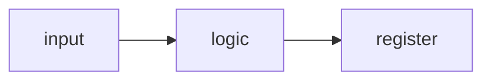

<!--
  Stone Arch Silicon lesson template.

  To add a lesson:
  1. Copy this file to Pages/page_N.md, where N is the next free number (no gaps).
  2. Replace the "# Lesson N: Title" line. That heading becomes the name in the sidebar.
  3. Commit to main. The site picks the page up on the next load.

  Rules:
  - Exactly one "# " heading per page, at the top.
  - Raw HTML is not rendered, except <details> and <summary> for solutions.
  - Comments like this one are stripped from the site.
  - Link to other lessons by file name, for example [Lesson 2](page_2.md).
  - Link to lab files with relative paths, for example [the lab](../files/lab01/).
    The site turns those into GitHub links.
  - Write in plain prose: no em dashes, define every new term the first time it appears.
-->

# Lesson N: Title

One or two sentences: what the reader will be able to do at the end of this lesson.

> [!NOTE]
> Before you start: which lessons and tools are needed. Plan on about two hours. Lab files are in [`files/labNN`](../files/labNN/).

## What you will learn

- First outcome
- Second outcome

## Key ideas

Keep theory short. Define each new term in plain words.

Math uses LaTeX between dollar signs, inline like $f_{max} = 1 / T$ or as a block:

$$
T_{clk} \ge t_{clk \to q} + t_{logic} + t_{setup}
$$

Images from the web go on their own line, with the caption in quotes, then a credit line that names the source and license:


Credit: [Source name](https://example.org/page.html), license name.

Diagrams can be written as code. Mermaid (GitHub also renders these):



WaveDrom timing diagrams (the site renders them; GitHub shows the source):

```wavedrom
{ signal: [
  { name: "clk", wave: "p...." },
  { name: "q",   wave: "0.1.." }
] }
```

> [!TIP]
> Callouts come in five kinds: NOTE, TIP, IMPORTANT, WARNING, and CAUTION.

## Worked example

Show complete, tested code with a language tag, then how to run it and what the output should be.

```systemverilog
module example (input wire a, b, output wire y);
    assign y = a & b;
endmodule
```

```bash
cd files/labNN
make sim
```

## Exercises

Order the exercises from easiest to hardest. Word them plainly: say exactly what to build, what the inputs and outputs are, and how to check the answer.

### Warm-up

1. A question answered on paper or with one command.

### Core

2. A lab task with a starter file and a self-checking testbench.

### Stretch

3. A task that combines ideas or goes past the lesson.

## Solutions

<details>
<summary>Exercise 1: short title</summary>

The answer, with a short explanation of why.

</details>

## Common mistakes

- A mistake people really make, and how to spot it.

## Checklist

- [ ] Something the reader can verify they can do

## Further reading

- [Title](https://example.org/): one line on why it is worth reading.

## Authors and reviewers

- Written by: @github-handle
- Reviewed by: @github-handle
