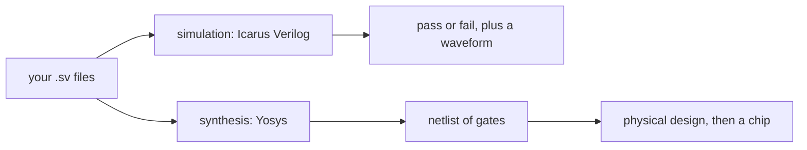

# Lesson 1: Setup and your first simulation

By the end of this lesson you will have open-source simulation tools installed, you will have run a Verilog design through a self-checking testbench, and you will have looked at its waveform.

> [!NOTE]
> Before you start: no Verilog experience is needed. You should be comfortable typing commands in a terminal (Linux, macOS, or WSL on Windows). Plan on about two hours.

## What you will learn

- What RTL, HDL, Verilog, and SystemVerilog mean
- The difference between simulating a design and synthesizing it
- How to install OSS CAD Suite and check that it works
- How a module and a testbench fit together
- How to read a waveform

## Where this track fits

RTL 101 is the first of four Stone Arch Silicon training tracks. Each track is its own site and repository:

| Track | What you learn | You need first |
|---|---|---|
| RTL 101 (this one) | Describe digital hardware in Verilog and SystemVerilog | Basic logic gates help, but are not required |
| [Verification 101](https://stone-arch-silicon.github.io/Verification_101/) | Prove that a design works: testbenches, cocotb, assertions, formal | RTL 101 lessons 1 to 6 |
| [PD 101](https://stone-arch-silicon.github.io/PD_101/) | Turn RTL into a chip layout with LibreLane and SKY130 | RTL 101 |
| [Analog 101](https://stone-arch-silicon.github.io/Analog_101/) | Transistor-level circuit design and layout | Circuits course or equivalent |

The last lesson of this track packages a design for [Tiny Tapeout](https://tinytapeout.com/), a program that lets you put a small design on a real manufactured chip.

## Key ideas

### RTL and HDLs

A digital chip is built from millions of tiny switches called transistors. Nobody designs a chip by placing every transistor by hand. Instead, you describe what the hardware should do, and tools turn that description into transistors.

An HDL (hardware description language) is a language for that description. Verilog is the most common HDL in the United States. SystemVerilog is a newer, larger version of Verilog that adds better types and powerful testbench features. Every Verilog file is also valid SystemVerilog, so this track uses SystemVerilog files (ending in `.sv`) and introduces the newer features when they help.

RTL (register-transfer level) is the style of description you will write: you describe registers (memory elements that hold values from one clock cycle to the next) and the logic that computes the next values. This lesson only has logic. Registers arrive in Lesson 5.

### Simulation and synthesis

The same Verilog file gets used in two very different ways:

- Simulation: a program (here, Icarus Verilog) pretends to be the hardware and computes what every signal does over time. You use it to check that your design is correct.
- Synthesis: a tool (here, Yosys) converts your description into a netlist, a list of real logic gates and the wires between them. That netlist is what eventually becomes a chip.



A testbench is Verilog code that only ever runs in simulation. It creates input values, feeds them to the design under test (often called the DUT), and checks the outputs. It is never synthesized, so it may use features that have no hardware meaning, such as printing text or waiting a number of nanoseconds.

### Waveforms

A simulator can record every signal change into a file (a VCD file, short for value change dump). A waveform viewer draws those changes as lines over time, which is the main way hardware engineers debug.


Credit: [Surfer project](https://surfer-project.org/), screenshot from the project website.

## Install the tools

This track uses [OSS CAD Suite](https://github.com/YosysHQ/oss-cad-suite-build), a single download from YosysHQ that contains Icarus Verilog, Verilator, Yosys, GTKWave, Surfer, and more.

1. Windows only: install WSL (Windows Subsystem for Linux) by running `wsl --install` in PowerShell, restart, and do every later step inside the Ubuntu terminal.
2. Open the [OSS CAD Suite releases page](https://github.com/YosysHQ/oss-cad-suite-build/releases/latest) and download the archive for your system (for example `linux-x64` or `darwin-arm64` for Apple silicon Macs).
3. Unpack it into your home folder and load it into your shell:

   ```bash
   cd ~
   tar -xzf ~/Downloads/oss-cad-suite-*.tgz
   source ~/oss-cad-suite/environment
   ```

4. Check that the tools run:

   ```bash
   iverilog -V | head -1
   verilator --version
   yosys -V
   ```

5. Add the `source` line to the end of your `~/.bashrc` (or `~/.zshrc` on macOS) so the tools load in every new terminal.
6. Get this course's files by cloning the repository:

   ```bash
   git clone https://github.com/Stone-Arch-Silicon/RTL_101.git
   cd RTL_101/files/lab01
   ```

> [!TIP]
> On macOS, the first run may be blocked by Gatekeeper. The OSS CAD Suite README explains how to allow it. If you would rather not install anything, the [IIC-OSIC-TOOLS](https://github.com/iic-jku/IIC-OSIC-TOOLS) container has the same tools plus everything used in PD 101 and Analog 101.

## Worked example: a half adder

A half adder adds two one-bit numbers. The answer can be 0, 1, or 2, so it needs two output bits: `sum` (the ones place) and `carry` (the twos place).

| a | b | carry | sum | meaning |
|---|---|---|---|---|
| 0 | 0 | 0 | 0 | 0 + 0 = 0 |
| 0 | 1 | 0 | 1 | 0 + 1 = 1 |
| 1 | 0 | 0 | 1 | 1 + 0 = 1 |
| 1 | 1 | 1 | 0 | 1 + 1 = 2, written 10 in binary |

The `sum` column is 1 when exactly one input is 1, which is the XOR function. The `carry` column is 1 only when both inputs are 1, which is AND. Here is the design, from [`files/lab01/half_adder.sv`](../files/lab01/half_adder.sv):

```systemverilog
`timescale 1ns/1ps
`default_nettype none

module half_adder (
    input  wire a,
    input  wire b,
    output wire sum,
    output wire carry
);
    assign sum   = a ^ b;   // XOR
    assign carry = a & b;   // AND
endmodule

`default_nettype wire
```

Line by line:

- `module half_adder ( ... );` starts a block of hardware with a name and a list of ports (its connections to the outside world). `endmodule` ends it.
- `input wire a` declares a one-bit input. A wire is a connection that carries whatever is driven onto it.
- `assign sum = a ^ b;` is a continuous assignment: `sum` is always equal to `a XOR b`. It is not a step that runs once. It describes a gate that is always connected.
- `` `default_nettype none `` makes a misspelled signal name an error instead of silently creating a new wire. Always use it.
- `` `timescale 1ns/1ps `` says that a delay of `#1` in this file means one nanosecond. It matters in testbenches.

The testbench, [`files/lab01/half_adder_tb.sv`](../files/lab01/half_adder_tb.sv), tries all four input combinations and compares the outputs with the answer that Verilog's own `+` operator gives:

```systemverilog
module half_adder_tb;
    logic a, b;          // signals we drive
    wire  sum, carry;    // signals the design drives
    int   errors = 0;

    half_adder dut (.a(a), .b(b), .sum(sum), .carry(carry));

    initial begin
        $dumpfile("dump.vcd");
        $dumpvars(0, half_adder_tb);
        for (int i = 0; i < 4; i++) begin
            {a, b} = i[1:0];     // try 00, 01, 10, 11
            #10;                 // wait 10 ns
            if ({carry, sum} !== a + b) errors++;
        end
        if (errors == 0) $display("PASS: all 4 cases correct");
        else             $display("FAIL: %0d case(s) wrong", errors);
        $finish;
    end
endmodule
```

- `half_adder dut (...)` creates one copy (an instance) of the design, named `dut`, and connects its ports.
- `initial begin ... end` runs once, from time zero. Only testbenches use `initial` like this.
- `{a, b} = i[1:0];` uses concatenation: the curly braces glue `a` and `b` into a two-bit value and assign the low two bits of `i` to it.
- `$display`, `$dumpfile`, `$dumpvars`, and `$finish` are system tasks: built-in simulator commands that start with a dollar sign.
- `!==` is "not identical". Unlike `!=`, it also treats unknown values as a mismatch, which is what you want in a checker.

Run it:

```bash
make
```

You should see:

```text
a=0 b=0 -> carry=0 sum=0
a=0 b=1 -> carry=0 sum=1
a=1 b=0 -> carry=0 sum=1
a=1 b=1 -> carry=1 sum=0
PASS: all 4 cases correct
```

Behind the scenes, `make` ran two commands. `iverilog -g2012 -o sim.out half_adder.sv half_adder_tb.sv` compiled both files (`-g2012` turns on SystemVerilog features), and `vvp sim.out` ran the result. Open the waveform with `make wave` (GTKWave) or `surfer dump.vcd`, then drag `a`, `b`, `sum`, and `carry` into the view.

Here is the same simulation drawn as a timing diagram. Each step lasts 10 ns:

```wavedrom
{ signal: [
  { name: "a",     wave: "0.1." },
  { name: "b",     wave: "0101" },
  { name: "sum",   wave: "01.0" },
  { name: "carry", wave: "0..1" }
], head: { text: "one pattern every 10 ns" } }
```

## Exercises

The starter files live in [`files/lab01`](../files/lab01/). Solutions are at the bottom of this page.

### Warm-up

1. Run `make` and confirm the PASS line. Then change `^` to `|` in `half_adder.sv` and run again. Which input pattern fails, and why does OR give the wrong `sum` there? Change it back afterward.
2. Open the waveform. At what simulation time does `carry` first become 1?
3. In the testbench, change `#10` to `#2`. Does the test still pass? What changes in the waveform?

### Core

4. Write the full truth table of a full adder by hand. A full adder adds three bits: `a`, `b`, and `cin` (a carry coming in from a lower bit). It has eight rows. Which rows have `cout = 1`?
5. Open [`files/lab01/full_adder.sv`](../files/lab01/full_adder.sv) and replace the two placeholder `assign` lines with real equations. Run `iverilog -g2012 -o fa.out full_adder.sv full_adder_tb.sv && vvp fa.out` until it prints PASS.
6. Delete the line `` `default_nettype none `` from your full adder and misspell one signal name in an `assign` (for example `cot` instead of `cout`). What happens when you compile? Now put the line back and compile again. Which behavior would you rather have?

### Stretch

7. Build a full adder out of two `half_adder` instances and one OR gate, in a new module called `full_adder_hier`. Hint: the first half adder adds `a` and `b`; the second adds that partial sum and `cin`. Verify it by renaming the module inside `full_adder_tb.sv` (or by copying the testbench).
8. Run `verilator --lint-only -Wall half_adder.sv`. Verilator is a second simulator that is also a strict code checker (a linter). It should print nothing. Now add the line `wire spare = a | b;` inside the module and run it again. What does it report, and why is that worth knowing?

## Solutions

<details>
<summary>Exercise 1: why OR fails</summary>

The pattern `a=1, b=1` fails. OR gives `sum = 1`, but 1 + 1 = 2, which is `carry=1, sum=0` in binary. XOR is 1 only when the inputs differ, which is exactly the ones digit of the sum.

</details>

<details>
<summary>Exercise 2: first carry</summary>

At 30 ns. The loop applies a new pattern at 0, 10, 20, and 30 ns, and `a=1, b=1` is the fourth pattern.

</details>

<details>
<summary>Exercise 3: shorter waits</summary>

It still passes. These assignments have no delay, so 2 ns is plenty of time. The waveform is squeezed into 8 ns instead of 40 ns. Real gates do have delay, but RTL simulation ignores it on purpose: timing is checked later, by static timing analysis.

</details>

<details>
<summary>Exercises 4 and 5: full adder</summary>

`cout` is 1 when at least two of the three inputs are 1 (rows 011, 101, 110, 111). `sum` is 1 when an odd number of inputs are 1.

```systemverilog
assign sum  = a ^ b ^ cin;
assign cout = (a & b) | (a & cin) | (b & cin);
```

The full file is in [`files/lab01/solutions/full_adder.sv`](../files/lab01/solutions/full_adder.sv).

</details>

<details>
<summary>Exercise 6: default_nettype</summary>

Without `` `default_nettype none ``, Verilog silently creates a new one-bit wire called `cot`. The design compiles, but `cout` is never driven, so the testbench sees `z` (an undriven value) and fails, and you have to hunt for the cause. With the line in place, the compiler stops at the typo and tells you the exact line.

</details>

<details>
<summary>Exercise 7: full adder from half adders</summary>

```systemverilog
module full_adder_hier (
    input  wire a, b, cin,
    output wire sum, cout
);
    wire s1, c1, c2;
    half_adder ha1 (.a(a),  .b(b),   .sum(s1),  .carry(c1));
    half_adder ha2 (.a(s1), .b(cin), .sum(sum), .carry(c2));
    assign cout = c1 | c2;
endmodule
```

Compile it together with `half_adder.sv`, because `full_adder_hier` uses that module.

</details>

<details>
<summary>Exercise 8: lint</summary>

Verilator reports `%Warning-UNUSEDSIGNAL: Signal is not used: 'spare'`. An unused signal is often a sign of a forgotten connection or a typo somewhere else. Lint warnings are cheap to fix early and expensive to discover late, so this course runs the linter on every design.

</details>

## Common mistakes

- Running `iverilog` without `-g2012`. SystemVerilog keywords such as `logic` and `int` then cause syntax errors.
- Forgetting `$finish`. The simulation never ends if a clock is running.
- Using `!=` in checks. If an output is unknown (`x`), `!=` also returns unknown, the `if` is skipped, and the bug slips through. Use `!==`.

## Checklist

- [ ] `iverilog`, `verilator`, and `yosys` all print a version number
- [ ] The half adder testbench prints PASS
- [ ] You can open a VCD file and add signals to the waveform view
- [ ] Your full adder passes `full_adder_tb.sv`

## Further reading

- [HDLBits](https://hdlbits.01xz.net/wiki/Main_Page): hundreds of small Verilog problems checked in your browser. Try the "Getting Started" and "Verilog Language: Basics" sets now.
- [Icarus Verilog documentation](https://steveicarus.github.io/iverilog/): command-line options and supported features.
- [Verilator user guide](https://verilator.org/guide/latest/): the linter and fast simulator used throughout this course.
- [MIT 6.205 Digital Systems Laboratory](https://fpga.mit.edu/6205/): a university course with clear readings on the same material.
