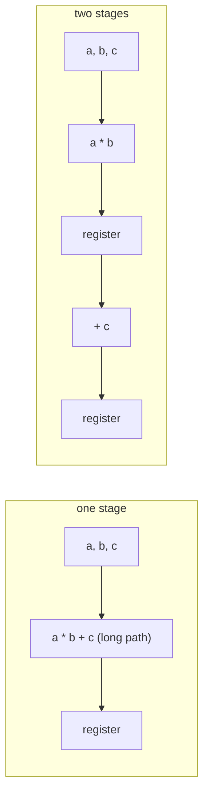

# Lesson 10: Handshakes, pipelines, and clock domain crossing

Real designs are made of blocks that pass data to each other, and not every block is ready every cycle. This lesson covers the valid/ready handshake used by nearly every on-chip interface, how pipelining trades latency for speed, and how to move signals safely between different clocks.

> [!NOTE]
> Before you start: finish Lesson 9. Plan on about three hours. Lab files are in [`files/lab10`](../files/lab10/).

## What you will learn

- The valid/ready handshake and its two rules
- Backpressure, and the skid buffer that keeps a pipeline running at full speed
- Latency versus throughput, and how to pipeline a slow computation
- Metastability, and why a signal from another clock domain needs a synchronizer
- Safe ways to move single bits, pulses, and whole words between clocks

## Key ideas

### The valid/ready handshake

A producer and a consumer agree on three signals: `data`, `valid` (driven by the producer: "data holds a real item"), and `ready` (driven by the consumer: "I can take an item"). An item transfers on a rising edge where both are 1.

Two rules keep everyone honest:

1. Once the producer raises `valid`, it must keep `valid` high and `data` unchanged until the transfer happens. It may not take an item back.
2. The producer must not wait for `ready` before raising `valid`. (The consumer may wait for `valid` before raising `ready`.) This prevents a deadlock where each side waits for the other.

```wavedrom
{ signal: [
  { name: "clk",   wave: "p......." },
  { name: "valid", wave: "01.0.1.0" },
  { name: "ready", wave: "0.1.0.1." },
  { name: "data",  wave: "x=.x.=.x", data: ["A", "B"] },
  { name: "both",  wave: "0.10..10" }
], head: { text: "two transfers" } }
```

The producer offers `A` and holds it while `ready` is low. `A` moves at the end of the first cycle where both signals are high (the `both` row). Later the producer offers `B` while the consumer is not ready: that is backpressure. `B` waits, unchanged, until `ready` rises, and then it moves too.

AXI, the bus standard used in most commercial chips, is built from exactly this handshake.

### Pipelining

Latency is how many cycles one item takes to get through. Throughput is how many items per cycle come out. Pipelining splits a long combinational path into stages separated by registers:

- Each stage is shorter, so the clock can be faster.
- Latency in cycles goes up (one per stage).
- Throughput stays at one item per cycle, if nothing stalls.



Data travels with a `valid` bit that moves through the same pipeline registers, so the output knows which cycles carry real results.

A plain pipeline register with a handshake computes `in_ready = out_ready || !out_valid`. That works, but the `ready` signal then passes combinationally through every stage, from the last consumer all the way to the first producer. In a long pipeline that path becomes the slowest in the chip. A skid buffer adds one spare register so `in_ready` comes straight from a flip-flop, which cuts the path while still moving one item per cycle.

### Clock domains and metastability

A clock domain is all the flip-flops driven by one clock. Every flip-flop in a domain is fed by the same clock network, a tree of buffers that physical design builds to deliver the clock everywhere at almost the same moment:


Credit: [OpenROAD-flow-scripts documentation, Flow Tutorial](https://openroad-flow-scripts.readthedocs.io/en/latest/tutorials/FlowTutorial.html), BSD-3-Clause.

When a signal comes from another clock (or from outside the chip), it can change at any moment, including inside a flip-flop's setup and hold window. Then the flip-flop can become metastable: its output hovers between 0 and 1 for an unpredictable time before settling either way. Logic reading that output may see different values in different places.

You cannot prevent metastability, but you can make failures astronomically rare by giving the flip-flop time to settle. The two-flip-flop synchronizer does exactly that: the first flop may go metastable, and the second samples it a full clock period later. The mean time between failures grows exponentially with the settling time $t_r$:

$$
\text{MTBF} = \frac{e^{t_r / \tau}}{T_0\, f_{clk}\, f_{data}}
$$

where $\tau$ and $T_0$ are properties of the flip-flop, and $f_{clk}$ and $f_{data}$ are the clock and data change rates. One extra period of settling typically turns a failure every few seconds into one every few thousand years.

### What can cross, and how

| What crosses | Safe method |
|---|---|
| One slowly changing bit (a mode, an enable) | 2-flop synchronizer |
| A one-cycle pulse | Toggle synchronizer: turn the pulse into a level change, synchronize the level, detect the change |
| A multi-bit counter that changes by one | Convert to Gray code first (only one bit changes at a time), then synchronize |
| A multi-bit word | Request/acknowledge handshake, or an asynchronous FIFO with Gray-coded pointers |

Never synchronize the bits of a binary bus separately. Each bit settles independently, so the receiver can see a mix of old and new bits that was never sent.

## Worked example: a skid buffer

[`files/lab10/skid_buffer.sv`](../files/lab10/skid_buffer.sv):

```systemverilog
assign in_ready = !skid_valid;   // accept new data while the spare slot is empty

always_ff @(posedge clk) begin
    if (!rst_n) begin
        out_valid  <= 1'b0;
        skid_valid <= 1'b0;
    end else if (out_ready || !out_valid) begin
        // the output register is free (or being emptied this cycle)
        if (skid_valid) begin
            out_data   <= skid_data;   // drain the spare slot first, keeps order
            out_valid  <= 1'b1;
            skid_valid <= 1'b0;
        end else begin
            out_data   <= in_data;     // pass the new item straight through
            out_valid  <= in_valid;
        end
    end else if (in_valid && in_ready) begin
        // downstream is stalled but upstream already sent: park it
        skid_data  <= in_data;
        skid_valid <= 1'b1;
    end
end
```

The testbench sends numbered items with random gaps, applies random backpressure, and checks that items come out in order with none lost or repeated. Then it removes all stalls and checks that exactly 100 items pass in 100 cycles:

```bash
cd files/lab10
make sim
make cdc
```

```text
PASS: 1402 items in order; 100 items in 100 cycles when nothing stalls
PASS: 50 pulses sent, 50 received
```

The second command runs [`files/lab10/pulse_sync.sv`](../files/lab10/pulse_sync.sv) between a 10 ns clock and a 14 ns clock.

## Exercises

### Warm-up

1. In the handshake diagram above, at which clock edges do transfers happen? Which rule would the producer break if it lowered `valid` before the first transfer?
2. A three-stage pipeline runs at 500 MHz. What is its latency in nanoseconds, and its throughput in items per second, when nothing stalls?
3. Why is it wrong to synchronize an 8-bit binary counter by putting a 2-flop synchronizer on each bit? Give a value pair where the receiver could see a number that was never sent.

### Core

4. Complete [`files/lab10/mac_pipe.sv`](../files/lab10/mac_pipe.sv): split `y = a * b + c` into two pipeline stages with a valid bit that travels alongside. Run `make mac` until it passes.
5. Write the plain pipeline register with `in_ready = out_ready || !out_valid` (no skid slot). Run it through `skid_buffer_tb.sv` by giving your module the same name and ports. Does it pass? What is the difference you cannot see in simulation?
6. In `cdc_tb.sv`, make the pulses arrive one domain-A cycle apart instead of 5 to 9. How many pulses are received now, and why? Write down the minimum spacing for `pulse_sync`.

### Stretch

7. Move 8-bit words between domains with a 4-phase handshake: the sender puts data on a bus and raises `req`; the receiver sees `req` (through a synchronizer), captures the data, and raises `ack`; the sender sees `ack` (through a synchronizer) and lowers `req`; the receiver sees `req` low and lowers `ack`. Why is it safe to pass the 8 data bits without synchronizers here?
8. Read Section 5 of the Cummings asynchronous FIFO paper (see Further reading) and sketch the full design: which pointers are Gray-coded, which are synchronized into which domain, and how full and empty are computed.

## Solutions

<details>
<summary>Exercise 1: transfers in the diagram</summary>

Two transfers: `A` at the end of the third cycle, the first cycle where `valid` and `ready` are both high, and `B` at the end of the seventh cycle. Lowering `valid` while `A` was still waiting would break rule 1: once offered, an item must stay offered until it is taken.

</details>

<details>
<summary>Exercise 2: latency and throughput</summary>

Latency is 3 cycles of 2 ns, so 6 ns. Throughput is one item per cycle, so $5 \times 10^8$ items per second.

</details>

<details>
<summary>Exercise 3: synchronizing a binary bus</summary>

The bits settle independently. Going from 7 (`0111`) to 8 (`1000`) changes four bits at once, and the receiver might catch any mix, such as `1111` (15) or `0000` (0). With Gray code, consecutive values differ in exactly one bit, so the receiver sees either the old value or the new one.

</details>

<details>
<summary>Exercise 4: pipelined multiply-accumulate</summary>

```systemverilog
logic [15:0] p1, c1;
logic        v1;

always_ff @(posedge clk) begin
    if (!rst_n) begin
        v1        <= 1'b0;
        out_valid <= 1'b0;
    end else begin
        v1        <= in_valid;
        out_valid <= v1;
    end
    p1 <= a * b;          // data registers need no reset
    c1 <= c;
    y  <= p1 + c1;
end
```

Full file: [`files/lab10/solutions/mac_pipe.sv`](../files/lab10/solutions/mac_pipe.sv).

</details>

<details>
<summary>Exercise 5: pipeline register without a skid slot</summary>

```systemverilog
assign in_ready = out_ready || !out_valid;
always_ff @(posedge clk) begin
    if (!rst_n) out_valid <= 1'b0;
    else if (in_ready) begin
        out_valid <= in_valid;
        out_data  <= in_data;
    end
end
```

It passes the same test, including full throughput. The difference is timing: `in_ready` is now a combinational function of `out_ready`, so chaining many of these stages creates one long `ready` path through all of them. Simulation has no notion of delay, so only static timing analysis would reveal it.

</details>

<details>
<summary>Exercise 6: pulses too close together</summary>

Fewer pulses arrive than were sent. Two pulses one domain-A cycle apart toggle the level twice before domain B samples it, so domain B sees no change at all, or a single change. The toggle must stay stable for at least two domain-B edges for the synchronizer to catch it and a third for the edge detector, so pulses need to be at least about 3 domain-B cycles apart.

</details>

<details>
<summary>Exercise 7: 4-phase handshake</summary>

```systemverilog
// sender, domain A (ack_sync is ack after a 2-flop synchronizer in domain A)
always_ff @(posedge clk_a) begin
    if (!rst_a_n) req <= 1'b0;
    else if (!req && !ack_sync && send) begin data_bus <= data_in; req <= 1'b1; end
    else if (req && ack_sync)           req <= 1'b0;
end

// receiver, domain B (req_sync is req after a 2-flop synchronizer in domain B)
always_ff @(posedge clk_b) begin
    if (!rst_b_n) begin ack <= 1'b0; valid <= 1'b0; end
    else begin
        valid <= 1'b0;
        if (req_sync && !ack)       begin data_out <= data_bus; valid <= 1'b1; ack <= 1'b1; end
        else if (!req_sync && ack)  ack <= 1'b0;
    end
end
```

The data bits are safe because they stop changing before `req` rises and stay put until the sender sees `ack`. By the time the synchronized `req` reaches domain B, the data has been stable for at least two domain-B cycles, so the receiver captures settled bits. The cost is speed: one word takes several cycles of both clocks.

</details>

<details>
<summary>Exercise 8: asynchronous FIFO</summary>

Both pointers are kept in binary for addressing and in Gray code for crossing. The write domain synchronizes the Gray read pointer to compute `full`; the read domain synchronizes the Gray write pointer to compute `empty`. Each flag is computed in the domain that needs it, from a pointer that may be a couple of cycles old. That makes the flags pessimistic (the FIFO may report full or empty slightly too long) but never wrong in the dangerous direction.

</details>

## Common mistakes

- Making `valid` depend on `ready`. The two sides can then wait for each other forever.
- Forgetting the valid bit when pipelining, so garbage from idle cycles looks like results.
- Synchronizing each bit of a binary bus separately.
- Placing logic between the two flops of a synchronizer. The first flop must feed the second directly.

## Checklist

- [ ] You can state both handshake rules and spot a violation in a waveform
- [ ] The skid buffer passes, including the full-throughput check
- [ ] `mac_pipe` passes with a latency of exactly two cycles
- [ ] You can choose the right crossing method for a bit, a pulse, a counter, and a word

## Further reading

- [ZipCPU: Building a skid buffer for AXI processing](https://zipcpu.com/blog/2019/05/22/skidbuffer.html): a detailed, formally verified skid buffer.
- [Cummings, "Clock Domain Crossing (CDC) Design and Verification Techniques Using SystemVerilog"](http://www.sunburst-design.com/papers/CummingsSNUG2008Boston_CDC.pdf): the standard CDC reference.
- [Cummings, "Simulation and Synthesis Techniques for Asynchronous FIFO Design"](http://www.sunburst-design.com/papers/CummingsSNUG2002SJ_FIFO1.pdf): the Gray-pointer FIFO.
- [Metastability in electronics](https://en.wikipedia.org/wiki/Metastability_(electronics)) on Wikipedia.
