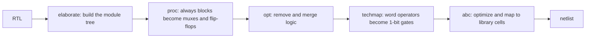

# Lesson 11: Lint, synthesis, and timing

Passing simulation is not the finish line. Your RTL also has to become good hardware: no hidden latches, no width surprises, and logic short enough to meet the clock. This lesson runs the linter, walks through what Yosys does to your code, and measures how coding choices change the result.

> [!NOTE]
> Before you start: finish Lesson 10. Plan on about two and a half hours. Lab files are in [`files/lab11`](../files/lab11/). The `make show` target needs Graphviz (`sudo apt install graphviz` or `brew install graphviz`).

## What you will learn

- What a linter catches that simulation misses
- The main steps inside synthesis: elaborate, `proc`, optimize, map
- How to read a Yosys cell report
- Logic depth, the critical path, and static timing analysis
- How the way you write RTL changes area and speed, and when it does not

## Key ideas

### Lint

A linter reads your code and reports constructs that are legal but suspicious. Simulators accept them silently, so the bugs show up later, often on silicon. Verilator with `-Wall` is a strong free linter:

| Warning | What it usually means |
|---|---|
| `WIDTHTRUNC`, `WIDTHEXPAND` | the two sides of an assignment or operator have different widths |
| `CASEINCOMPLETE` | a `case` without `default` that does not cover every value |
| `LATCH` | a combinational block that does not assign a signal on every path |
| `BLKSEQ` | blocking `=` inside a clocked block |
| `UNUSEDSIGNAL` | a signal nobody reads, often a missing connection |
| `MULTIDRIVEN` | one signal driven from two places |

Treat warnings as errors. When a warning is truly intended, silence that one line with a comment such as `/* verilator lint_off UNUSEDSIGNAL */` and explain why.

### What synthesis does



After `proc`, Yosys has replaced your `always` blocks with word-level cells: adders, comparators, multiplexers, and flip-flops. Here is a small counter module at that stage:


Credit: [Yosys documentation, Synthesis starter](https://yosyshq.readthedocs.io/projects/yosys/en/latest/getting_started/example_synth.html), YosysHQ, ISC license.

After `techmap`, each word-level cell is expanded into single-bit gates, and `abc` then optimizes that sea of gates and maps it to the cells of a library. For a chip, that library is a standard cell library such as SKY130's, which PD 101 uses.


Credit: [Yosys documentation, Synthesis starter](https://yosyshq.readthedocs.io/projects/yosys/en/latest/getting_started/example_synth.html), YosysHQ, ISC license.

### Logic depth and timing

The critical path is the slowest path from one register (or input) to the next register (or output). Its delay sets the fastest clock, as in Lesson 5. Before you have a real cell library, logic depth (the largest number of gates in series) is a useful first estimate. Yosys reports it with `ltp -noff` (longest topological path, ignoring flip-flops).

Static timing analysis (STA) does this properly: it adds up the real delay of every cell and wire on every path, compares the total against the clock period, and reports the slack, meaning how much time is left over. Negative slack means the design fails at that clock speed.


Credit: [LibreLane documentation, Newcomers' Tutorial](https://librelane.readthedocs.io/en/latest/getting_started/newcomers/index.html), Apache-2.0.

You will run STA in PD 101. For now, depth is enough to compare designs.

## Worked example: how you write an adder matters

Lesson 7 built a ripple-carry adder from a generate loop of full adders. [`files/lab11/add32.sv`](../files/lab11/add32.sv) is the same function written as `a + b`. Compare them:

```bash
cd files/lab11
make adders
```

```text
== add32 (a + b)
   Number of cells:                235
Longest topological path in add32 (length=18):
== adder_n with N=32 (32 full adders in a chain)
   Number of cells:                224
Longest topological path in adder_n (length=96):
```

(Exact numbers change between Yosys versions; the shape of the result does not.)

Almost the same number of cells, but the hand-built ripple adder is more than five times deeper. When Yosys sees `+`, it builds a fast parallel-prefix carry network. When it sees 32 instances of your own full adder, it keeps the structure you gave it, and the carry still ripples. Writing `+` and letting the tool choose was the better design here.

Now the other direction. [`popcount_loop.sv`](../files/lab11/popcount_loop.sv) counts 1 bits with a loop that adds one bit at a time, and [`popcount_tree.sv`](../files/lab11/popcount_tree.sv) adds them in a balanced tree. You might expect the tree to be much shallower:

```bash
make popcount
```

Run it and see. Exercise 4 asks you to explain the result.

## Exercises

### Warm-up

1. Run `make lint` on [`files/lab11/lint_me.sv`](../files/lab11/lint_me.sv). List each warning name and the line it points at.
2. Run `yosys -s synth.ys` and find, in the output, where `proc` reports the flip-flops it created and where `stat` lists the final cells.
3. If a path has logic depth 18 and each gate takes about 0.15 ns, roughly what clock frequency could it support, ignoring flip-flop overhead?

### Core

4. Run `make popcount`. Do the two styles differ? Explain why synthesis treats this case differently from the adder case.
5. Fix every warning in `lint_me.sv` without changing its intended behavior (read the comments). Run the linter again: new warnings can appear once the first batch is fixed. Stop when it prints nothing.
6. Run `make show` to draw `mux4` from Lesson 3 as a schematic. Open `mux4.svg` in a browser. How many `$_MUX_` or `$mux` cells do you see, and does that match the three `mux2` instances?

### Stretch

7. Write a 16-bit multiplier two ways: `a * b`, and a shift-and-add loop inside `always_comb` (for each bit of `b`, add `a` shifted left if that bit is 1). Verify they match on 10,000 random inputs, then compare cell count and depth. What do you conclude?
8. Take the ALU from Lesson 8 and find its critical path with `ltp -noff`. Then pipeline the adder output (register `sum` and use it one cycle later) and measure again. What happened to the depth, and what did the change cost in cycles?

## Solutions

<details>
<summary>Exercise 1: lint warnings</summary>

Five warnings: `WIDTHTRUNC` on the `assign inc` line, `WIDTHEXPAND` on the `pick = inc` line, `UNUSEDSIGNAL` for `dbg`, `CASEINCOMPLETE` on the `case (sel)` line, and `BLKSEQ` on the `acc = 0` line inside `always_ff`.

</details>

<details>
<summary>Exercise 2: reading the Yosys log</summary>

Look for the `PROC_DFF` section, which prints one line per flip-flop it creates (the popcount has none, because it is purely combinational), and for the block that begins `Number of cells:` near the end, which lists each gate type and its count.

</details>

<details>
<summary>Exercise 3: frequency from depth</summary>

$18 \times 0.15 = 2.7$ ns, so about 370 MHz. Real numbers depend on the cells chosen, the wires between them, and the flip-flops at each end, which is why STA exists.

</details>

<details>
<summary>Exercise 4: why the popcounts match</summary>

With the `synth` command, both styles come out the same size and depth. A popcount is a sum of single bits, and Yosys merges chains of additions into one multi-operand adder cell (`$macc`) before mapping, so both descriptions reach the mapper in the same form. You can see it by stopping early: `yosys -p "read_verilog -sv popcount_loop.sv; synth -top popcount_loop -run :fine; stat"` shows a single `$macc` cell, and so does the tree version. The adder case was different because the ripple version was made of separate module instances, which Yosys does not reorganize into a different carry structure. The lesson: tools restructure arithmetic expressions well, so write the clearest expression, and measure before you spend effort on manual restructuring.

</details>

<details>
<summary>Exercise 5: fixing lint_me</summary>

```systemverilog
logic [7:0] inc;                     // full width

always_ff @(posedge clk) begin
    if (!rst_n) acc <= 8'd0;         // nonblocking in a clocked block
    else        acc <= acc + din;
end

assign inc = din + 8'd1;

always_comb begin
    case (sel)
        2'd0:    pick = din;
        2'd1:    pick = acc;
        2'd2:    pick = inc;
        default: pick = 8'd0;        // covers sel == 3
    endcase
end
```

and delete the unused `dbg` signal. Full file: [`files/lab11/solutions/lint_me.sv`](../files/lab11/solutions/lint_me.sv).

</details>

<details>
<summary>Exercise 6: the mux4 schematic</summary>

After flattening, you should see three 2-to-1 multiplexer cells for each bit of the data path, matching the three `mux2` instances. With `W = 1` (the default) that is exactly three mux cells.

</details>

<details>
<summary>Exercise 7: multiplier styles</summary>

```systemverilog
always_comb begin
    p_loop = '0;
    for (int i = 0; i < 16; i++) if (b[i]) p_loop = p_loop + (32'(a) << i);
end
assign p_star = a * b;
```

Both are correct. On Yosys 0.33, `a * b` gave about 1,600 cells with depth 34, while the loop gave about 2,000 cells with depth 118. The `if (b[i])` turns each step into a conditional addition, which hides the multiplication from Yosys, so it builds a long chain of adders instead of its own multiplier structure. Unlike the popcount, this pattern is not recognized. Write `*` and let the tool choose.

</details>

<details>
<summary>Exercise 8: pipelining the ALU</summary>

Registering the adder output splits the longest path into two shorter ones, so `ltp -noff` reports a smaller depth. The cost is one cycle of latency for any result that depends on the adder, and the extra flip-flops. This is the trade from Lesson 10, measured on your own design.

</details>

## Common mistakes

- Ignoring lint warnings because the simulation passes.
- Hand-optimizing logic that the synthesis tool already optimizes, while making it harder to read.
- Reading cell counts without depth (or the other way around). Area and speed usually trade against each other.
- Assuming results from one tool version hold forever. Re-measure after upgrading.

## Checklist

- [ ] `lint_me.sv` is clean under `verilator --lint-only -Wall`
- [ ] You can name the main synthesis steps and what each does
- [ ] You measured the adder comparison and can explain the depth difference
- [ ] You can explain slack and critical path in one sentence each

## Further reading

- [Yosys documentation: Synthesis starter](https://yosyshq.readthedocs.io/projects/yosys/en/latest/getting_started/example_synth.html): every pass in `synth`, with pictures.
- [Verilator warnings reference](https://verilator.org/guide/latest/warnings.html).
- [Static timing analysis](https://en.wikipedia.org/wiki/Static_timing_analysis) on Wikipedia.
- [PD 101](https://stone-arch-silicon.github.io/PD_101/): the next track, where synthesis maps to SKY130 cells and STA runs on a real layout.
