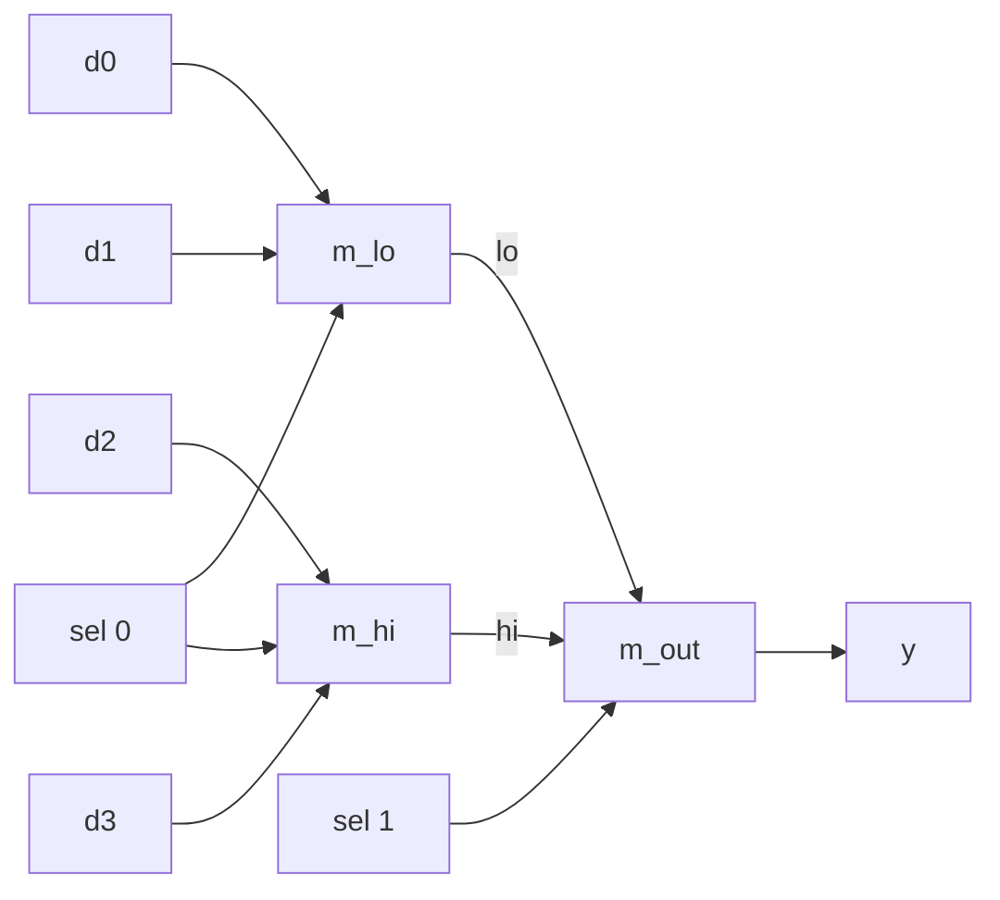

# Lesson 3: Combinational logic and module hierarchy

Combinational logic computes its outputs only from its current inputs, with no memory. This lesson builds multiplexers, decoders, and adders out of smaller modules, the way every large design is built.

> [!NOTE]
> Before you start: finish Lessons 1 and 2. Plan on about two hours. Lab files are in [`files/lab03`](../files/lab03/).

## What you will learn

- What makes logic combinational
- Boolean algebra basics: truth tables, sum of products, De Morgan's laws
- Multiplexers and decoders, the two most common building blocks
- How to instantiate modules and connect their ports
- How to build a larger circuit from copies of a smaller one

## Key ideas

### Combinational logic

A circuit is combinational when its outputs depend only on the inputs right now. Give it the same inputs and it always gives the same outputs. There is a short delay while signals travel through the gates, and then the outputs settle. Every `assign` statement you wrote so far describes combinational logic.

Any combinational function can be written as a truth table, and any truth table can be written as a sum of products: OR together one AND term for each row where the output is 1. For a two-input XOR:

$$
y = \bar{a}\,b + a\,\bar{b}
$$

(In logic equations, writing two signals next to each other means AND, $+$ means OR, and a bar means NOT.) Two rules let you rearrange expressions. They are De Morgan's laws:

$$
\overline{a\,b} = \bar{a} + \bar{b} \qquad \overline{a + b} = \bar{a}\,\bar{b}
$$

You rarely simplify logic by hand in RTL, since synthesis does it for you, but these rules help you read schematics and reason about conditions such as `!(valid && ready)`.

### The multiplexer

A multiplexer (mux) picks one of several inputs based on a select signal. A 2-to-1 mux is the conditional operator:

```systemverilog
assign y = sel ? b : a;   // sel = 0 gives a, sel = 1 gives b
```

Muxes are everywhere: choosing between operations in an ALU, choosing which register to read, choosing between a reset value and a new value. Here is the real 2-to-1 mux cell from the SKY130 library, shown as a symbol and as transistors:


Credit: [SkyWater SKY130 PDK documentation](https://skywater-pdk.readthedocs.io/en/main/contents/libraries/sky130_fd_sc_hd/cells/mux2/README.html), Apache-2.0.


Credit: [SkyWater SKY130 PDK documentation](https://skywater-pdk.readthedocs.io/en/main/contents/libraries/sky130_fd_sc_hd/cells/mux2/README.html), Apache-2.0.

### The decoder

A decoder turns an $n$-bit number into $2^n$ separate lines, exactly one of which is 1. A 2-to-4 decoder with an enable:

| en | in | out |
|---|---|---|
| 0 | any | `0000` |
| 1 | 0 | `0001` |
| 1 | 1 | `0010` |
| 1 | 2 | `0100` |
| 1 | 3 | `1000` |

Decoders select one of several registers to write, one of several devices on a bus, or one row of a memory.

### Hierarchy

Large designs are trees of modules. You write a small module once and instantiate it (place a copy) wherever you need it. Each instance gets a name and its own connections:

```systemverilog
mux2 #(.W(W)) m_lo (.a(d0), .b(d1), .sel(sel[0]), .y(lo));
//  ^parameter  ^instance name     ^named port connections
```

- Named connections, `.port(signal)`, are the safest style: order does not matter and a missing port is easy to spot.
- If the signal has the same name as the port, `.sel` is short for `.sel(sel)`.
- `.*` connects every port to a signal of the same name. It is handy in testbenches; in RTL it hides mistakes, so this course avoids it there.
- `#(.W(4))` sets a parameter of that instance. Parameters get a full lesson in Lesson 7.



## Worked example: a 4-to-1 mux from three 2-to-1 muxes

[`files/lab03/mux4.sv`](../files/lab03/mux4.sv) builds the tree in the diagram above:

```systemverilog
module mux4 #(parameter int W = 1) (
    input  wire [W-1:0] d0, d1, d2, d3,
    input  wire [1:0]   sel,
    output wire [W-1:0] y
);
    wire [W-1:0] lo, hi;   // internal wires connect the instances

    mux2 #(.W(W)) m_lo  (.a(d0), .b(d1), .sel(sel[0]), .y(lo));
    mux2 #(.W(W)) m_hi  (.a(d2), .b(d3), .sel(sel[0]), .y(hi));
    mux2 #(.W(W)) m_out (.a(lo), .b(hi), .sel(sel[1]), .y(y));
endmodule
```

The low select bit chooses within each pair, and the high bit chooses between the pairs. `lo` and `hi` are internal wires: they are not ports, so they exist only inside `mux4`.

The decoder fits on one line, using a shift: shifting `0001` left by `in` places moves the single 1 into position `in`.

```systemverilog
assign out = en ? (4'b0001 << in) : 4'b0000;
```

Run the exhaustive check:

```bash
cd files/lab03
make sim
```

```text
PASS: mux4 and decoder2to4 correct
```

## Exercises

### Warm-up

1. Write the sum of products for a 2-to-1 mux with inputs `a`, `b`, and `sel`. Check it against the truth table.
2. Using De Morgan's laws, rewrite `!(valid && ready)` without the outer NOT.
3. Rewrite `mux4` as a single `assign` with nested conditional operators. Which version is easier to read?

### Core

4. Complete [`files/lab03/adder4.sv`](../files/lab03/adder4.sv): instantiate `full_adder` four times so the carry ripples from bit 0 to bit 3. Run `make adder` until all 512 cases pass.
5. Write `decoder3to8` with an enable, in one `assign`. Write a short exhaustive testbench for it (16 cases with the enable).
6. Write `cmp4`: inputs `a`, `b` (4-bit unsigned), outputs `eq`, `lt`, `gt`. Exactly one output must be 1 for every input pair. Test all 256 pairs, including a check that exactly one output is high.

### Stretch

7. Build `mux8` (8-to-1, parameter `W`) from two `mux4` instances and one `mux2`. Test it with random data on all eight inputs and every select value.
8. Every logic function can be built from NAND gates alone. Write a `nand2` module, then build XOR from four `nand2` instances. Verify it against `^` for all four input pairs.

## Solutions

<details>
<summary>Exercise 1: mux as sum of products</summary>

$y = \overline{sel}\,a + sel\,b$. When `sel` is 0 the second term is 0 and the first term is `a`; when `sel` is 1 it is the other way around.

</details>

<details>
<summary>Exercise 2: De Morgan</summary>

`!(valid && ready)` equals `!valid || !ready`: "not both" is the same as "at least one is missing".

</details>

<details>
<summary>Exercise 3: one-line mux4</summary>

```systemverilog
assign y = sel[1] ? (sel[0] ? d3 : d2) : (sel[0] ? d1 : d0);
```

It is shorter, but the structural version shows the hardware tree. A `case` statement (Lesson 4) is usually the clearest choice for wider muxes.

</details>

<details>
<summary>Exercise 4: 4-bit ripple-carry adder</summary>

```systemverilog
full_adder fa0 (.a(a[0]), .b(b[0]), .cin(c[0]), .sum(sum[0]), .cout(c[1]));
full_adder fa1 (.a(a[1]), .b(b[1]), .cin(c[1]), .sum(sum[1]), .cout(c[2]));
full_adder fa2 (.a(a[2]), .b(b[2]), .cin(c[2]), .sum(sum[2]), .cout(c[3]));
full_adder fa3 (.a(a[3]), .b(b[3]), .cin(c[3]), .sum(sum[3]), .cout(c[4]));
```

Remember to delete the two placeholder `assign` lines, or `sum` and `c` will have two drivers. Full file: [`files/lab03/solutions/adder4.sv`](../files/lab03/solutions/adder4.sv).

</details>

<details>
<summary>Exercise 5: 3-to-8 decoder</summary>

```systemverilog
module decoder3to8 (
    input  wire [2:0] in,
    input  wire       en,
    output wire [7:0] out
);
    assign out = en ? (8'b0000_0001 << in) : 8'b0;
endmodule
```

</details>

<details>
<summary>Exercise 6: comparator</summary>

```systemverilog
module cmp4 (
    input  wire [3:0] a, b,
    output wire       eq, lt, gt
);
    assign eq = (a == b);
    assign lt = (a < b);
    assign gt = (a > b);
endmodule
```

In the testbench, check `eq + lt + gt == 1` for every pair, as well as each output against the expected relation.

</details>

<details>
<summary>Exercise 7: mux8</summary>

```systemverilog
module mux8 #(parameter int W = 1) (
    input  wire [W-1:0] d0, d1, d2, d3, d4, d5, d6, d7,
    input  wire [2:0]   sel,
    output wire [W-1:0] y
);
    wire [W-1:0] lo, hi;
    mux4 #(.W(W)) m_lo (.d0(d0), .d1(d1), .d2(d2), .d3(d3), .sel(sel[1:0]), .y(lo));
    mux4 #(.W(W)) m_hi (.d0(d4), .d1(d5), .d2(d6), .d3(d7), .sel(sel[1:0]), .y(hi));
    mux2 #(.W(W)) m_out (.a(lo), .b(hi), .sel(sel[2]), .y(y));
endmodule
```

</details>

<details>
<summary>Exercise 8: XOR from NAND</summary>

```systemverilog
module nand2 (input wire a, b, output wire y);
    assign y = ~(a & b);
endmodule

module xor_from_nand (input wire a, b, output wire y);
    wire n1, n2, n3;
    nand2 g1 (.a(a),  .b(b),  .y(n1));
    nand2 g2 (.a(a),  .b(n1), .y(n2));
    nand2 g3 (.a(b),  .b(n1), .y(n3));
    nand2 g4 (.a(n2), .b(n3), .y(y));
endmodule
```

</details>

## Common mistakes

- Driving the same signal from two places, for example an `assign` and an instance output. The simulator shows `x` where the drivers disagree, and lint reports a multiple-driver error.
- Connecting a 1-bit port to a 4-bit signal. Verilog quietly truncates or pads, so always run the linter: Verilator reports a width warning (`WIDTHEXPAND` or `WIDTHTRUNC`).
- Forgetting the instance name. `mux2 (.a(x) ...)` is a syntax error; every instance needs a name.

## Checklist

- [ ] You can write a sum of products from a truth table
- [ ] You can instantiate a module with named port connections and a parameter
- [ ] `make sim` passes in `lab03`
- [ ] Your `adder4` passes all 512 cases

## Further reading

- [HDLBits: Modules and Hierarchy](https://hdlbits.01xz.net/wiki/Module): short problems on instantiation and port connection.
- [HDLBits: Combinational Logic](https://hdlbits.01xz.net/wiki/Wire_decl): gates, muxes, and arithmetic circuits.
- [De Morgan's laws](https://en.wikipedia.org/wiki/De_Morgan%27s_laws) on Wikipedia.
- [SKY130 standard cell list](https://skywater-pdk.readthedocs.io/en/main/contents/libraries/sky130_fd_sc_hd/README.html): every gate synthesis can choose from, with schematics and layouts.
