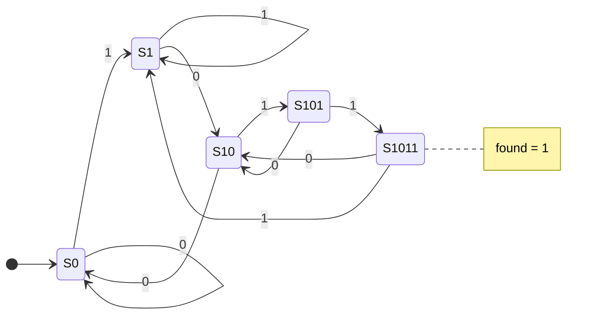
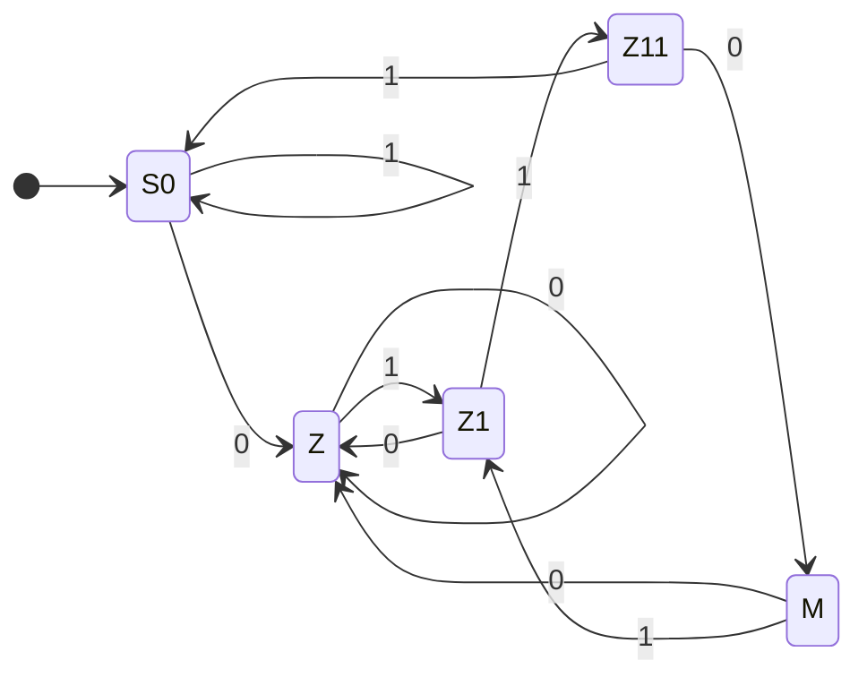

# Lesson 6: Finite state machines

A finite state machine (FSM) is the standard way to build control logic: a small register that remembers which step you are on, plus logic that decides the next step. Protocol handlers, controllers, and sequencers are all FSMs. This lesson shows how to draw one, how to code it in a style that synthesizes cleanly, and how to test it.

> [!NOTE]
> Before you start: finish Lesson 5. Plan on about two and a half hours. Lab files are in [`files/lab06`](../files/lab06/).

## What you will learn

- States, transitions, and outputs, and how to draw them
- The difference between Moore and Mealy machines
- The three-part coding style: state register, next-state logic, output logic
- Using `enum` types for state names
- Testing an FSM with a reference model

## Key ideas

### States and transitions

An FSM has a finite set of states. It is in exactly one state at a time, held in a register. At every clock edge it moves to a next state chosen by the current state and the inputs. Its outputs come from the state (and sometimes the inputs).

Before writing any code, draw the state diagram: a circle per state and an arrow per transition, labeled with the input that causes it. Here is a machine that watches a serial input `din`, one bit per clock, and recognizes the pattern 1011. Each state's name is how much of the pattern has been seen so far:



The tricky arrows are the ones out of a partial match. In `S101`, a 0 does not send you back to the start: the last two bits received are `10`, which is the beginning of a new match, so the machine goes to `S10`. The rule is always "what is the longest end of the input so far that is also a start of the pattern?". This also makes overlapping matches work: in `1011011`, the final `1` of the first match is reused.

### Moore and Mealy

- In a Moore machine, outputs depend only on the current state. Outputs change only after a clock edge, and they come straight from registers through a little logic, which is clean and safe. The detector above is a Moore machine: `found` is 1 whenever the state is `S1011`.
- In a Mealy machine, outputs depend on the state and the current inputs. It reacts one cycle earlier and often needs fewer states, but an input glitch can pass straight to the output.

### The three-part coding style

```systemverilog
typedef enum logic [2:0] {S0, S1, S10, S101, S1011} state_t;
state_t state, next;

// 1) state register: the only flip-flops
always_ff @(posedge clk) begin
    if (!rst_n) state <= S0;
    else        state <= next;
end

// 2) next-state logic: combinational
always_comb begin
    next = state;                 // default: stay
    case (state)
        S0:    if (din) next = S1;    else next = S0;
        S1:    if (din) next = S1;    else next = S10;
        S10:   if (din) next = S101;  else next = S0;
        S101:  if (din) next = S1011; else next = S10;
        S1011: if (din) next = S1;    else next = S10;
        default: next = S0;
    endcase
end

// 3) output logic
assign found = (state == S1011);
```

Every clocked design, FSMs included, has the same shape once it is synthesized: combinational logic computes the next value, and a register stores it and feeds it back. The figure below is Yosys's view of a tiny clocked `always` block: an adder and two multiplexers (the next-state logic) feed a D flip-flop (`$dff`, the state register).


Credit: [Yosys documentation, Interactive design investigation](https://yosyshq.readthedocs.io/projects/yosys/en/latest/using_yosys/more_scripting/interactive_investigation.html), YosysHQ, ISC license.

`typedef enum` gives each state a name, so waveforms and error messages say `S101` instead of `3`. The `logic [2:0]` sets the width of the encoding. The state assignment, meaning which bit pattern stands for each state, is up to you or the tool:

| Encoding | Bits for 5 states | Notes |
|---|---|---|
| Binary | 3 | fewest flip-flops |
| One-hot | 5 | one flip-flop per state; very simple next-state logic, often faster |
| Gray | 3 | neighboring states differ in one bit |

Synthesis tools can re-encode an FSM they recognize, so start with binary and named states.

## Worked example: the 1011 detector

The code above is [`files/lab06/seq_1011.sv`](../files/lab06/seq_1011.sv). Its testbench sends 2,000 random bits and uses a much simpler reference model: a 4-bit shift register of the last four bits. Whenever that history equals `1011`, the FSM must say `found`.

```systemverilog
@(posedge clk) hist = {hist[2:0], din};   // the model sees the same bit as the FSM
#1;
if (found !== (hist == 4'b1011)) errors++;
```

That is a general testing pattern: a reference model does not need to be built the same way as the design. It only needs to be obviously correct.

```bash
cd files/lab06
make sim
```

```text
PASS: 118 hits found in 2000 random bits, no mistakes
```

(Your number of hits will differ, since the bits are random.)

```wavedrom
{ signal: [
  { name: "clk",   wave: "p......." },
  { name: "din",   wave: "1.0.1.0." },
  { name: "state", wave: "==.===.=", data: ["S0", "S1", "S10", "S0", "S1", "S10"] },
  { name: "found", wave: "0......." }
], head: { text: "no match yet" } }
```

Each column of a timing diagram shows the values just after a rising edge, and every register takes the value its logic computed from the column before. Here `state` always reflects the bits up to the previous column.

## Exercises

### Warm-up

1. Draw the state diagram for a Moore machine that detects `0110` (overlapping allowed). Label every arrow.
2. Starting from `S0`, trace the detector through the input `1 0 1 1 0 1 1`. List the state after each bit, and say when `found` is 1.
3. How many flip-flops does the detector need with binary encoding? With one-hot?

### Core

4. Complete [`files/lab06/traffic.sv`](../files/lab06/traffic.sv), a traffic light that cycles red for 4 cycles, green for 5, yellow for 2. Use an `enum` for the three states and one shared timer register. Run `make traffic` until five full rounds pass.
5. Write `seq_1011_mealy`, the Mealy version of the detector: `found` is 1 in the same cycle that the final `1` is on `din`, before the clock edge. How many states does it need? Test it against the shift-register model (careful: the model must include the current `din`).
6. Run the traffic light synthesis with `yosys -p "read_verilog -sv traffic.sv; synth -top traffic; stat"`. Does Yosys report that it found and re-encoded an FSM? Look for lines mentioning `fsm`.

### Stretch

7. A vending machine sells an item for 15 cents. Inputs `coin5` and `coin10` are one-cycle pulses (never both at once). When the total reaches 15 or more, `dispense` is 1 for that cycle and the credit returns to 0; if the total was 20, `change` is also 1. Draw the diagram, then implement it as a Mealy machine with three credit states.
8. Add a pedestrian button to the traffic light: if `walk_req` is 1 at any time during green, green ends early, but only after green has lasted at least 2 cycles. Write the specification as comments before you code it, then extend the testbench.

## Solutions

<details>
<summary>Exercise 1: 0110 detector</summary>

States by progress: `S0` (nothing), `Z` (seen 0), `Z1` (seen 01), `Z11` (seen 011), `M` (seen 0110, output 1).



From `M` (input ended in `0110`), a 1 gives `...01`, so the machine goes to `Z1`; a 0 gives `...00`, so it goes to `Z`.

</details>

<details>
<summary>Exercise 2: trace</summary>

After each bit: `S1, S10, S101, S1011 (found), S10, S101, S1011 (found)`. Two matches, sharing the middle `1`.

</details>

<details>
<summary>Exercise 3: flip-flop count</summary>

Five states need 3 flip-flops in binary ($2^3 = 8 \ge 5$) and 5 in one-hot.

</details>

<details>
<summary>Exercise 4: traffic light</summary>

```systemverilog
typedef enum logic [1:0] {S_RED, S_GREEN, S_YELLOW} state_t;
state_t state, next;
logic [2:0] timer, last;

always_comb begin
    case (state)
        S_RED:    last = 3'd3;   // 4 cycles: timer 0, 1, 2, 3
        S_GREEN:  last = 3'd4;   // 5 cycles
        S_YELLOW: last = 3'd1;   // 2 cycles
        default:  last = 3'd0;
    endcase
end

always_comb begin
    next = state;
    if (timer == last) begin
        case (state)
            S_RED:    next = S_GREEN;
            S_GREEN:  next = S_YELLOW;
            default:  next = S_RED;
        endcase
    end
end

always_ff @(posedge clk) begin
    if (!rst_n) begin
        state <= S_RED;
        timer <= 3'd0;
    end else begin
        state <= next;
        timer <= (timer == last) ? 3'd0 : timer + 3'd1;
    end
end
```

Plus a `case` on `state` that drives `lights`. Full file: [`files/lab06/solutions/traffic.sv`](../files/lab06/solutions/traffic.sv).

</details>

<details>
<summary>Exercise 5: Mealy detector</summary>

Four states are enough, because the "complete match" state is replaced by the output itself:

```systemverilog
typedef enum logic [1:0] {S0, S1, S10, S101} state_t;
// state register as before
always_comb begin
    next = state;
    case (state)
        S0:   if (din) next = S1;   else next = S0;
        S1:   if (din) next = S1;   else next = S10;
        S10:  if (din) next = S101; else next = S0;
        S101: if (din) next = S1;   else next = S10;
        default: next = S0;
    endcase
end
assign found = (state == S101) && din;
```

In the testbench, check `found` before the clock edge, against `{hist[2:0], din} == 4'b1011`.

</details>

<details>
<summary>Exercise 6: FSM extraction</summary>

Yosys runs an `fsm` pass during `synth`. For a state register with an `enum` type and a clean next-state block, its log shows it detecting the state register and re-encoding it (for example as one-hot). If the state register is also used for something else, such as being sent directly to an output, Yosys leaves it alone.

</details>

<details>
<summary>Exercise 7: vending machine</summary>

```systemverilog
typedef enum logic [1:0] {C0, C5, C10} credit_t;
credit_t credit, next;

always_ff @(posedge clk) begin
    if (!rst_n) credit <= C0;
    else        credit <= next;
end

always_comb begin
    next = credit; dispense = 1'b0; change = 1'b0;
    case (credit)
        C0:  if (coin5) next = C5;
             else if (coin10) next = C10;
        C5:  if (coin5) next = C10;
             else if (coin10) begin dispense = 1'b1; next = C0; end
        C10: if (coin5) begin dispense = 1'b1; next = C0; end
             else if (coin10) begin dispense = 1'b1; change = 1'b1; next = C0; end
        default: next = C0;
    endcase
end
```

The defaults at the top of the block keep the Mealy outputs from turning into latches.

</details>

<details>
<summary>Exercise 8: pedestrian button</summary>

One possible specification: while in green, if `walk_req` has been seen since green began and the timer is at least 1 (green has lasted 2 cycles), move to yellow at the next edge. Store the request in a one-bit register `walk_seen` that is set by `walk_req` and cleared when the light leaves green. Then change the green-to-yellow condition to `timer == last || (walk_seen && timer >= 3'd1)`.

</details>

## Common mistakes

- Missing the default `next = state;`, which makes `next` a latch when no case matches.
- Putting output logic inside the state register's `always_ff`. The outputs then come one cycle late. Keep outputs in their own combinational block or `assign`.
- Wrong arrows out of partial matches. Always ask which suffix of the input so far is also a prefix of the pattern.
- No reset for the state register. The FSM then starts in an unknown state in simulation, and in a random one on silicon.

## Checklist

- [ ] You can draw a state diagram from a word description
- [ ] You can explain Moore versus Mealy with one example of each
- [ ] The 1011 detector passes, and the traffic light passes five rounds
- [ ] Every FSM you write has a reset, an `enum`, and a default next state

## Further reading

- [HDLBits: Finite State Machines](https://hdlbits.01xz.net/wiki/Fsm1): a long sequence of FSM problems, from two states up to protocol receivers.
- [Cummings, "The Fundamentals of Efficient Synthesizable Finite State Machine Design"](http://www.sunburst-design.com/papers/CummingsICU2002_FSMFundamentals.pdf): coding styles and their trade-offs.
- [Finite-state machine](https://en.wikipedia.org/wiki/Finite-state_machine) on Wikipedia.
- [Mermaid state diagram syntax](https://mermaid.js.org/syntax/stateDiagram.html): how the diagrams on this page are written, so you can draw your own in lesson files.
