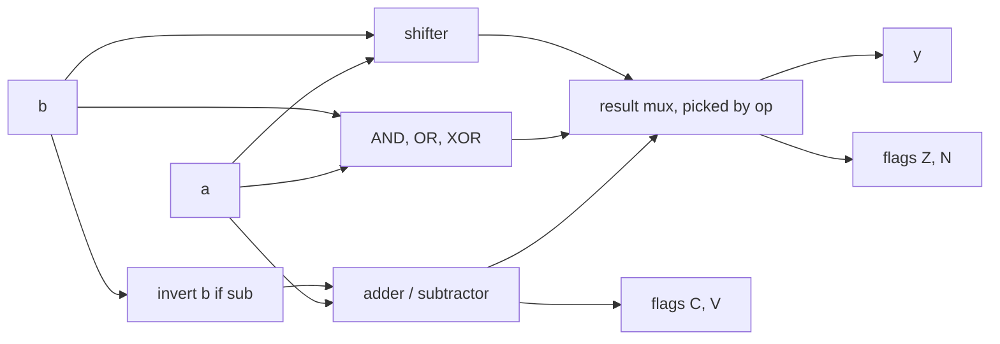

# Lesson 8: Arithmetic datapaths and an ALU

An arithmetic logic unit (ALU) is the part of a processor that adds, subtracts, compares, and shifts. Building one ties together everything so far: operators, `case`, signed numbers, and careful testing. This lesson also explains why adders are the speed limit of so many designs.

> [!NOTE]
> Before you start: finish Lesson 7, especially the two's complement part of Lesson 2. Plan on about two and a half hours. Lab files are in [`files/lab08`](../files/lab08/).

## What you will learn

- Why a ripple-carry adder is slow, and how carry lookahead speeds it up
- How one adder performs both addition and subtraction
- The four status flags: zero, negative, carry, and overflow
- Logical and arithmetic shifts
- How to verify a datapath exhaustively against a simple model

## Key ideas

### The carry chain

A ripple-carry adder is a row of full adders where each carry feeds the next bit. Bit $i$ cannot finish until bit $i-1$ has produced its carry, so the delay grows linearly with the width: a 32-bit ripple adder is roughly 32 full-adder delays long. Inside each full adder, the carry comes from a small network of transistors like this one:


Credit: [SkyWater SKY130 PDK documentation](https://skywater-pdk.readthedocs.io/en/main/contents/libraries/sky130_fd_sc_hd/cells/fa/README.html), Apache-2.0.

### Carry lookahead

For each bit, define two signals:

$$
g_i = a_i\,b_i \qquad p_i = a_i \oplus b_i
$$

$g_i$ (generate) is 1 when bit $i$ makes a carry by itself, because both inputs are 1. $p_i$ (propagate) is 1 when exactly one input is 1, so a carry coming in passes straight through.

Then the carry into the next bit is $c_{i+1} = g_i + p_i\,c_i$. Substituting repeatedly gives every carry directly from the inputs, for example:

$$
c_2 = g_1 + p_1 g_0 + p_1 p_0 c_0
$$

Each carry becomes a two-level AND-OR expression instead of a chain, at the cost of more gates. Real fast adders apply this idea in a tree (parallel-prefix adders such as Kogge-Stone or Brent-Kung), giving delay proportional to $\log_2 n$ instead of $n$. When you write `a + b`, Yosys already builds a fast structure for you, which Lesson 11 measures.

### Subtraction with the same adder

Two's complement makes $a - b = a + \bar{b} + 1$. So an adder-subtractor inverts `b` and sets the carry-in to 1 when subtracting:

```systemverilog
assign b_in = sub ? ~b : b;
assign sum  = {1'b0, a} + {1'b0, b_in} + {8'd0, sub};   // 9 bits: keep the carry
```

### Status flags

| Flag | Name | Meaning |
|---|---|---|
| Z | zero | the result is all zeros |
| N | negative | the top bit of the result is 1 (negative if read as signed) |
| C | carry | the adder's carry out; for subtraction it is 1 when $a \ge b$ as unsigned numbers (no borrow) |
| V | overflow | the signed result is wrong because it did not fit in 8 bits |

Overflow happens when the two numbers going into the adder have the same sign but the result has the other sign. Adding two positives can never give a negative, unless the true answer was too big.

A signed comparison $a < b$ comes from the subtraction $a - b$: the result is negative, unless it overflowed, in which case the sign bit is backwards. So:

$$
(a < b)_{\text{signed}} = N \oplus V
$$

### Shifts

| Expression | Name | Fills with |
|---|---|---|
| `a << s` | logical left | zeros on the right |
| `a >> s` | logical right | zeros on the left |
| `$signed(a) >>> s` | arithmetic right | copies of the sign bit, so it divides signed numbers by $2^s$ (rounding down) |

A shift by a variable amount becomes a barrel shifter: one layer of muxes per bit of `s`, so an 8-bit shifter needs three layers.



## Worked example: an 8-bit ALU

[`files/lab08/alu8.sv`](../files/lab08/alu8.sv) supports eight operations. The opcodes live in [`files/lab08/alu_ops.svh`](../files/lab08/alu_ops.svh), an include file that both the design and the testbench pull in with `` `include "alu_ops.svh" ``, so they cannot disagree:

| op | Name | Result |
|---|---|---|
| 0 | ADD | `a + b` |
| 1 | SUB | `a - b` |
| 2 | AND | `a & b` |
| 3 | OR | `a \| b` |
| 4 | XOR | `a ^ b` |
| 5 | SLL | `a << b[2:0]` |
| 6 | SRL | `a >> b[2:0]` |
| 7 | SLT | 1 if `a < b` as signed numbers, else 0 |

The provided file is complete except for two marked TODOs: the overflow signal and the SLT result. The testbench, [`files/lab08/alu8_tb.sv`](../files/lab08/alu8_tb.sv), is exhaustive: every operation with every pair of inputs, $8 \times 256 \times 256 = 524{,}288$ cases, each compared with a few lines of integer arithmetic:

```systemverilog
sa = $signed(a); sb = $signed(b);    // -128 .. 127
case (op)
    OP_ADD: begin full = sa + sb; ey = 8'(i + j); ec = (i + j) > 255; ev = (full > 127) || (full < -128); end
    OP_SUB: begin full = sa - sb; ey = 8'(i - j + 256); ec = (i >= j); ev = (full > 127) || (full < -128); end
    ...
endcase
```

Because 32-bit integers cannot overflow here, the model's overflow test is just "is the true answer outside $-128$ to $127$?". Run the starter version first to see what fails:

```bash
cd files/lab08
make sim
```

```text
ADD a=1 b=127: y=128 znvc=0100, expected y=128 znvc=0110
...
FAIL: 65408 of 524288 cases wrong
```

## Exercises

### Warm-up

1. Compute the result and all four flags by hand for 8-bit `ADD` of `0x7F + 0x01`, `ADD` of `0xFF + 0x01`, and `SUB` of `0x05 - 0x07`.
2. What is `8'b1001_0110 >> 2`? What is `$signed(8'b1001_0110) >>> 2`, and what decimal division does it perform?
3. Using $c_{i+1} = g_i + p_i c_i$, write $c_3$ in terms of $g_0..g_2$, $p_0..p_2$, and $c_0$.

### Core

4. Implement TODO 1 (the overflow signal `ovf`) and TODO 2 (SLT) in `alu8.sv`. Run `make sim` until all 524,288 cases pass.
5. Run `make synth` and record the number of cells. Then temporarily replace the shared adder with separate `a + b` and `a - b` expressions selected by a mux. Does the cell count go up or down? Why?
6. Write `cla4`, a 4-bit carry-lookahead adder using $g$ and $p$, with every carry written out as an AND-OR expression. Verify it against `a + b + cin` for all 512 cases.

### Stretch

7. Widen `op` to 4 bits and add `OP_SRA` (arithmetic shift right) and `OP_SLTU` (unsigned less-than). Extend the testbench model and keep it exhaustive. Which existing adder output gives you SLTU for free?
8. Write `sat_add_s8`: signed 8-bit addition that clamps to 127 or $-128$ on overflow instead of wrapping. Use the overflow rule from this lesson. Test it against an integer model for all 65,536 input pairs.

## Solutions

<details>
<summary>Exercise 1: flags by hand</summary>

- `0x7F + 0x01 = 0x80`: Z=0, N=1, C=0, V=1. Two positives gave a negative.
- `0xFF + 0x01 = 0x00`: Z=1, N=0, C=1, V=0. As signed numbers this is $-1 + 1 = 0$, correct, so no overflow; as unsigned it wrapped, so carry.
- `0x05 - 0x07 = 0xFE` ($-2$): Z=0, N=1, C=0 (5 is below 7, so there was a borrow), V=0.

</details>

<details>
<summary>Exercise 2: shifts</summary>

`8'b1001_0110 >> 2` is `0010_0101`. The arithmetic version is `1110_0101`. The input is $-106$ and the result is $-27$, which is $-106 / 4 = -26.5$ rounded down.

</details>

<details>
<summary>Exercise 3: carry 3</summary>

$c_3 = g_2 + p_2 g_1 + p_2 p_1 g_0 + p_2 p_1 p_0 c_0$.

</details>

<details>
<summary>Exercise 4: overflow and SLT</summary>

```systemverilog
assign ovf = (a[7] == b_in[7]) && (sum[7] != a[7]);
...
OP_SLT: y = {7'd0, sum[7] ^ ovf};
```

Use `b_in`, not `b`: for subtraction the adder really adds the inverted `b`. SLT shares the subtraction because `sub` is also set for `OP_SLT`. Full file: [`files/lab08/solutions/alu8.sv`](../files/lab08/solutions/alu8.sv). To run it, compile from the `lab08` folder so the include file is found: `iverilog -g2012 -I. -o s.out solutions/alu8.sv alu8_tb.sv && vvp s.out`.

</details>

<details>
<summary>Exercise 5: shared versus separate adders</summary>

Separate `a + b` and `a - b` usually costs more cells: two adders plus a mux instead of one adder plus an inverter row. Synthesis cannot always discover that the two operations can share hardware, so describing the sharing yourself is a real optimization. Your exact numbers depend on the Yosys version.

</details>

<details>
<summary>Exercise 6: carry-lookahead adder</summary>

```systemverilog
module cla4 (
    input  wire [3:0] a, b,
    input  wire       cin,
    output wire [3:0] sum,
    output wire       cout
);
    wire [3:0] g = a & b;
    wire [3:0] p = a ^ b;
    wire [4:0] c;
    assign c[0] = cin;
    assign c[1] = g[0] | (p[0] & c[0]);
    assign c[2] = g[1] | (p[1] & g[0]) | (p[1] & p[0] & c[0]);
    assign c[3] = g[2] | (p[2] & g[1]) | (p[2] & p[1] & g[0]) | (p[2] & p[1] & p[0] & c[0]);
    assign c[4] = g[3] | (p[3] & g[2]) | (p[3] & p[2] & g[1]) | (p[3] & p[2] & p[1] & g[0])
                | (p[3] & p[2] & p[1] & p[0] & c[0]);
    assign sum  = p ^ c[3:0];
    assign cout = c[4];
endmodule
```

</details>

<details>
<summary>Exercise 7: SRA and SLTU</summary>

```systemverilog
OP_SRA:  y = $signed(a) >>> b[2:0];
OP_SLTU: y = {7'd0, ~sum[8]};       // subtract: carry out is 0 exactly when a < b unsigned
```

Set `sub` for `OP_SLTU` too. The carry out of `a + ~b + 1` is the "no borrow" flag, so unsigned less-than is its inverse. In the model, use `ey = (i < j)` for SLTU and an integer arithmetic shift for SRA.

</details>

<details>
<summary>Exercise 8: signed saturating add</summary>

```systemverilog
module sat_add_s8 (
    input  wire  [7:0] a, b,
    output logic [7:0] y
);
    logic [7:0] s;
    logic       ovf;
    assign s   = a + b;
    assign ovf = (a[7] == b[7]) && (s[7] != a[7]);
    assign y   = !ovf ? s : (a[7] ? 8'h80 : 8'h7F);   // too negative: -128; too positive: +127
endmodule
```

</details>

## Common mistakes

- Computing overflow from `b` instead of the value actually fed into the adder (`b_in`), which breaks subtraction.
- Forgetting the 9th bit, so the carry out is lost.
- Using `>>>` on an unsigned operand. Without `$signed`, it behaves exactly like `>>`.
- Testing only a few hand-picked values. For 8-bit datapaths, exhaustive testing is cheap; use it.

## Checklist

- [ ] You can explain generate and propagate, and why lookahead is faster than ripple
- [ ] You can compute Z, N, C, and V by hand
- [ ] `alu8` passes all 524,288 cases
- [ ] You know why signed less-than is $N \oplus V$

## Further reading

- [Carry-lookahead adder](https://en.wikipedia.org/wiki/Carry-lookahead_adder) and [Kogge-Stone adder](https://en.wikipedia.org/wiki/Kogge%E2%80%93Stone_adder) on Wikipedia.
- [ASIC 101](https://stone-arch-silicon.github.io/ASIC_101/): the club's course that compares ripple, lookahead, and carry-select adders all the way to layout.
- [HDLBits: Arithmetic Circuits](https://hdlbits.01xz.net/wiki/Hadd): adders, overflow detection, and BCD adders.
- [Berkeley EECS 151](https://inst.eecs.berkeley.edu/~eecs151/): lecture notes on adder and multiplier architectures.
